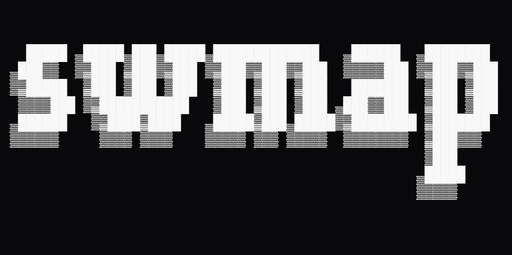

# SWMap



**SWMap** is an advanced **Service Worker security analyzer** for modern web apps. It discovers, fetches, and analyzes Service Workers to surface scope risks, caching issues, route exposure, Workbox/Flutter usage, and dangerous code patterns — and, when you enable it, it can **prove** behavior with a headless browser.

Built for bug bounty hunters, red teams, and product security engineers who want rigor, speed, and explainability.

## Why SWMap?

Most PWA/SW security reviews stop at “is there a service worker?”. Real apps are messier. **SWMap** digs into **what** the worker does and **how** it can widen attack surface:

- **Security-first analysis** — Effective scope calc (incl. `Service-Worker-Allowed`), widened/root scopes, mixed-origin pitfalls.
- **Caching scrutiny** — Sensitive route patterns (`/api`, `/auth`, `/user`, `/admin`), pre/runtime caching, cache-poisoning indicators.
- **Workbox awareness** — Detects Workbox and modules (precaching, routing, strategies).
- **Code-risk patterns** — `eval` / `Function` usage, string timers, credentialed fetches, dynamic execution hints.
- **Infra/CDN SW detection** — Tags known CDN/infrastructure SWs (e.g. Akamai 3PM) so you don’t over-hunt them.
- **Operator-ready outputs** — TSV (grep-able) and JSON (automation); quiet/verbose modes; evidence dumps.
- **Deep analysis (Static + Dynamic)** — **AST-based** parsing for precision and **Headless** validation for real behavior.
- **WAF-friendly + profiles** — Can send browsery headers and load per-target profiles.
- **Auth-only SWs** — Can import a Netscape cookie file into headless to reach SWs that only appear after login.

## Features at a Glance

- **Dynamic runtime validation (headless/Playwright)**: prove interception, precache behavior, and SWR hints.
- **AST recursion (bounded, same-origin)**: follows `importScripts`/ESM up to a safe depth for better route/strategy visibility.
- **Scope math & misconfig flags**: effective scope calculation + `Service-Worker-Allowed` detection; flags widened/root scopes.
- **Workbox & Flutter awareness**: detects Workbox patterns/strategies and zero-byte Flutter SWs.
- **Route seeding & same-origin crawl**: drive coverage with `--route-seed`; crawling is on when headless is on.
- **Proxy-ready**: `--proxy` is wired for both HTTP fetching and headless context.
- **Login automation**: `--login-script` + `--login-wait` to get past auth-gated registrations.
- **Evidence bundles**: `--evidence-dir` dumps summary, headless responses, redacted HTML.
- **CI-friendly outputs**: `--json`, `--sarif`, and `--nuclei-out` for re-verification.

---

**Flow:** Targets → Fetch/Probe → Static (scope, routes, patterns) → AST → *(optional)* Headless validate → Score & flag → Filter/Serialize → Summarize.

---

## 🚀 Quick Start

### Requirements

- **Python** ≥ 3.9
- **macOS / Linux / Windows**
- **Optional (AST fallback):** **Node.js** ≥ 16 (used when the Python AST can’t parse)
- **Optional (Headless):** **Playwright** + a browser (we’ll install below)

### Install

**Linux / macOS (bash):**

```bash
git clone https://github.com/bl4ck0w1/swmap.git
cd swmap
python -m venv .venv
source .venv/bin/activate
pip install -r requirements.txt
# install playwright runtime browser
python -m playwright install chromium
# make the installer executable
chmod +x scripts/install.sh
# add swmap to PATH if your install script does that
bash scripts/install.sh
````

**Windows (PowerShell):**

```powershell
git clone https://github.com/bl4ck0w1/swmap.git
cd swmap
py -m venv .venv
.\.venv\Scripts\activate
pip install -r requirements.txt
python -m playwright install chromium
#powershell
Set-ExecutionPolicy -Scope Process -ExecutionPolicy Bypass
# install the CLI entrypoint
.\scripts\install.ps1
```

After install, you should have the `swmap` command on PATH. You can always run in place with:

```bash
python swmap.py
```

### Verify

```bash
swmap --help
# or
python swmap.py --help
```

### Update Security Patterns (optional)

```bash
python scripts/update_patterns.py --update
# validate
python scripts/update_patterns.py --validate
```

## 🧰 CLI Overview

```bash

$ swmap --help
                                                            
  █████  █████ ███ █████ █████████████    ██████   ████████ 
 ███░░  ░░███ ░███░░███ ░░███░░███░░███  ░░░░░███ ░░███░░███
░░█████  ░███ ░███ ░███  ░███ ░███ ░███   ███████  ░███ ░███
 ░░░░███ ░░███████████   ░███ ░███ ░███  ███░░███  ░███ ░███
 ██████   ░░████░████    █████░███ █████░░████████ ░███████ 
░░░░░░     ░░░░ ░░░░    ░░░░░ ░░░ ░░░░░  ░░░░░░░░  ░███░░░  
                                                   ░███     
                                                   █████    
                                                  ░░░░░     

Service Worker Security Mapper - Advanced SW recon tool

Information Options
  -h, --help                Show this help message and exit
  -V, --version             Show version information and exit

Input Options
  target                    Single URL to scan (e.g., https://target.com)
  -i, --input               Read targets from file (one URL per line)

Scan Options
  -P, --parallel            Concurrent scans (default: 6, max: 20)
  -t, --timeout             Request timeout in seconds (default: 15)
  --max-sw-bytes            Maximum SW script size in bytes (default: 524288)
  --max-routes              Maximum routes to extract per SW (default: 50)
  --deep                    Legacy deep static parse hint (sets AST recursion to 3 if not overridden)
  --delay-ms                Delay between headless navigations (ms) to avoid rate-limits (default: 0)
  --no-probe                Skip common SW filename probing

Enhanced Analysis (runtime + AST)
  --headless                Enable headless browser validation (default: off)
  --no-headless             Disable headless browser validation
  --ast                     Enable AST analysis (default)
  --no-ast                  Disable AST analysis
  --ast-depth               Recurse importScripts/ESM to this depth (default: 2; or 3 if --deep and not overridden)
  --headless-timeout        Headless timeout (ms)
  --headless-max-routes     Max routes to probe dynamically
  --headless-crawl          Crawl same-origin links (default)
  --no-headless-crawl       Disable headless crawl
  --route-seed              Seed route (repeatable)
  --login-script            Path to a JS file to run before crawl (auto-login etc.)
  --login-wait              CSS selector to wait for after login
  --prove-interception      Prove response interception via Service Worker
  --no-prove-interception   Disable interception proof
  --prove-precache          Prove precache via CacheStorage audit
  --no-prove-precache       Disable precache proof
  --prove-swr               Try to detect stale-while-revalidate behavior
  --no-prove-swr            Disable SWR proof
  --offline-replay          After crawl, go offline and replay seeds to prove offline render
  --offline-wait            Wait after going offline before replay (ms, default: 1500)
  --logout-url              URL to visit to logout before offline replay
  --logout-script           JS to execute to logout before offline replay

Security Analysis Options
  --risk-threshold          Only output findings with risk score >= N (0-100)
  --no-risk-assessment      Skip risk scoring and security analysis
  --include-patterns        Output detected security patterns in detail
  --sensitive-only          Only output workers with sensitive route patterns

Output Options
  --json                    Emit stable JSON v1
  --sarif                   Write SARIF 2.1.0 file with findings
  --nuclei-out              Directory to write Nuclei verifier templates (one per SW)
  --evidence-dir            Directory to dump evidence bundle per target
  --explain                 Print a decision chain for each target (discover/probe/runtime)
  --quiet                   Suppress comments and progress messages
  --verbose                 Detailed analysis output
  -o, --output              Write results table/JSONL to file

Network Options
  --ua, --user-agent        Custom User-Agent string
  --header                  Extra HTTP header (repeatable, e.g., "K: V")
  --cookie                  Cookie header value
  --proxy                   HTTP/SOCKS proxy URL (applies to HTTP fetches and headless)
  --cookies                 Path to Netscape cookie file to import into headless context (auth-only SWs)
  --profile                 Load headers/cookies/proxy/login/route seeds from JSON profile (CLI args override profile)
  --waf-friendly            Apply a browser-like header set to reduce WAF/tooling blocks

For more information visit: https://github.com/bl4ck0w1/swmap
```

## 🧾 Usage Examples

**1. Single target, TSV to stdout (quick recon)**

```bash
swmap https://app.example.com
```

**2. Batch scan, JSON to file (automation)**

```bash
swmap -i targets.txt --json -o results.jsonl
```

**3. Deeper static pass, but only keep interesting SWs**

```bash
swmap -i urls/subdomains.txt --deep --sensitive-only --risk-threshold 70 --json
```

**4. Scan as logged-in user (cookies + browsery headers + headless)**

```bash
swmap https://portal.example.com --headless --cookie "SESSION=abcd1234" --waf-friendly --route-seed /app/ --route-seed /api/me --json
```

**5. Headless proof + evidence bundle (for a report)**

```bash
swmap https://pwa.example.com --headless --prove-interception --prove-precache --route-seed /dashboard --route-seed /api/profile --evidence-dir evidence/ --json
```

**6. Generate SARIF + Nuclei from a scan (CI / team handoff)**

```bash
swmap -i scope.txt --json --sarif swmap.sarif --nuclei-out nuclei-templates/
```

**7. Use a profile (headers/proxy/cookies stored in JSON)**

```bash
swmap https://intranet.example.com --profile profiles/intranet.json --json
```


## ❓ Some Questions You Could Ask

1. **Could this Service Worker control more of my origin than intended?**
   Check for broadened scopes (e.g. `Service-Worker-Allowed: /`) and verify the **effective scope** SWMap calculates.

2. **Is anything sensitive being precached or served from cache?**
   Look for `/api`, `/auth`, `/user`, `/admin` routes in findings and confirm via **headless cache audit** when possible.

3. **Which strategies is the worker actually using — and are they safe here?**
   Identify `cacheFirst`, `networkFirst`, `staleWhileRevalidate`, etc. Match strategy to data sensitivity.

4. **Do static indicators match real behavior?**
   Use **headless validation** to confirm route interception and network flows before filing or remediating.

5. **What would make this finding actionable in CI or a bug report?**
   Export **JSON**, include flags, scope math, and (if used) headless witnesses; set `--risk-threshold` to enforce policy.


## 🛠️ Troubleshooting

* If Playwright says it can’t find a browser, run:

  ```bash
  python -m playwright install chromium
  ```

* If AST keeps failing on minified SWs, try `--no-ast` to confirm it’s the parser, or install Node.js ≥ 16 so the fallback can run.

* If WAF keeps blocking you, try `--waf-friendly` and/or supply the exact headers your browser used.

* If Powershell Blocks the script during the installation, try `Set-ExecutionPolicy -Scope Process -ExecutionPolicy Bypass` and re-run the script.

* If you encounter any issues, please open an issue on GitHub.

## 🤝 Contributing

We welcome contributions! Please see our [Contributing Guidelines](CONTRIBUTING.md) for details.

1. Fork the repository
2. Create a feature branch (`git checkout -b feature/amazing-feature`)
3. Commit your changes (`git commit -m 'Add amazing feature'`)
4. Push to the branch (`git push origin feature/amazing-feature`)
5. Open a Pull Request

## License

This project is licensed under the **Apache 2.0** License — see the [LICENSE](LICENSE) file for details.

## Author

### Security Researcher 😎

* [LinkedIn](https://www.linkedin.com/in/elie-uwimana)

## Compliance & Ethics

⚠️ **Authorized Use Only**

SWMap is designed for:

* Penetration testing with explicit written permission
* Bug bounty programs within platform guidelines
* Government / enterprise cybersecurity operations
* Academic research in controlled environments

Do **not** run it on infrastructure you don’t own or aren’t authorized to test.
